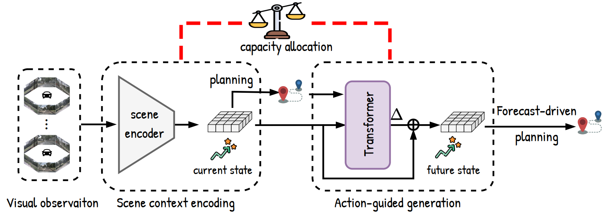

#  Driving in the Occupancy World: Vision-Centric 4D Occupancy Forecasting and Planning via World Models for Autonomous Driving

[](https://arxiv.org/abs/2408.14197) [](https://drive-occworld.github.io/) 


> Yu Yang<sup>1,\*</sup>, Jianbiao Mei<sup>1,\*</sup>, Yukai Ma<sup>1</sup>, Siliang Du<sup>2,†</sup>, Wenqing Chen<sup>2</sup>, Yijie Qian<sup>1</sup>, Yuxiang Feng<sup>1</sup>, Yong Liu<sup>1,†</sup> <br>
> <sup>1</sup> Zhejiang University <sup>2</sup> Huawei Technologies <br>
> <sup>\*</sup> Equal Contribution <sup>†</sup> Corresponding Authors


## 📢 News
- `[2026-1-31]` Our folow work [IR-WM](https://arxiv.org/abs/2510.16729) is accepted by ICRA 2026! Please see the `ir-wm` branch for more details.u
- `[2024-12-10]` Our Drive-OccWorld is accepted by AAAI 2025 (Oral)!

- `[2024-10-14]` We released our project website [here](https://drive-occworld.github.io/).

- `[2024-08-26]` The paper can be accessed at [arxiv](https://arxiv.org/abs/2408.14197).

---


## 🎯 Abstract
<div style="text-align:center;">
  
</div>

**4D Occupancy Forecasting and Planning via World Model**. Drive-OccWorld takes observations and trajectories as input, incorporating flexible action conditions for **action-controllable generation**. By leveraging world knowledge and the generative capacity of the world model, we further integrate it with a planner for **continuous forecasting and planning**.


## 📝 Getting Started

- [Installation](DOCS/INSTALL.MD) 

- [Prepare Dataset](DOCS/DATASET.MD)

- [Train and Evaluation](DOCS/TRAIN_EVAL.MD)

## 🎥 Demo of 4D Occupancy and Flow Forecasting

Drive-OccWorld understands how the world evolves by accurately modeling the dynamics of movable objects and the future states of the static environment.

### Scene 1 (Lane Change)
<div style="text-align:center;">
    
</div>

### Scene 2 (Pedestrian Crossing)
<div style="text-align:center;">
    
</div>

### Scene 3 (Vehicle Following)
<div style="text-align:center;">
    
</div>


## 🚗 Demo of Continuous Forecasting and Planning (E2E Planning)

Drive-OccWorld plans trajectories through forecasting future occupancy state and selecting optimal trajectory based on a comprehensive occupancy-based cost function.

### Scene 1 (Turn Left to Avoid Stopped Vehicle)
<div style="text-align:center;">
    
</div>

<div style="text-align:center;">
    
</div>

### Scene 2 (Slowing Down to Wait for Crossing Pedestrians)
<div style="text-align:center;">
    
</div>

<div style="text-align:center;">
    
</div>

### Scene 3 (Turn Right to Avoid Stopped Vehicle)
<div style="text-align:center;">
    
</div>

<div style="text-align:center;">
    
</div>


## Acknowledgments

We utilized the following repos during development:

* [ViDAR](https://github.com/OpenDriveLab/ViDAR)
* [Cam4DOcc](https://github.com/haomo-ai/Cam4DOcc)
* [ST-P3](https://github.com/OpenDriveLab/ST-P3)
* [UniAD](https://github.com/OpenDriveLab/UniAD)

Thanks for their Awesome open-sourced work!

<!-- ## 📄 License

This project is released under the [Apache 2.0 license](LICENSE).  -->

## 🔖 Citation

If you find our project useful, please kindly cite us via:

```bibtext
@article{mei2025vision,
  title={Vision-Centric 4D Occupancy Forecasting and Planning via Implicit Residual World Models},
  author={Mei, Jianbiao and Yang, Yu and Yang, Xuemeng and Wen, Licheng and Lv, Jiajun and Shi, Botian and Liu, Yong},
  journal={arXiv preprint arXiv:2510.16729},
  year={2025}
}
@article{yang2024driving,
  title={Driving in the occupancy world: Vision-centric 4d occupancy forecasting and planning via world models for autonomous driving},
  author={Yang, Yu and Mei, Jianbiao and Ma, Yukai and Du, Siliang and Chen, Wenqing and Qian, Yijie and Feng, Yuxiang and Liu, Yong},
  journal={arXiv preprint arXiv:2408.14197},
  year={2024}
}